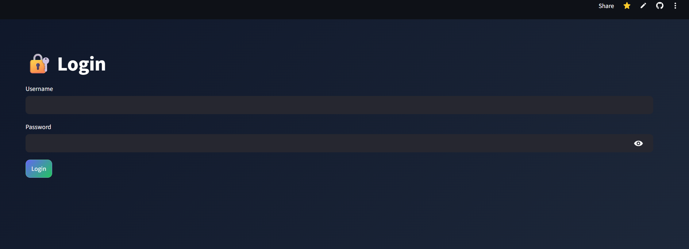
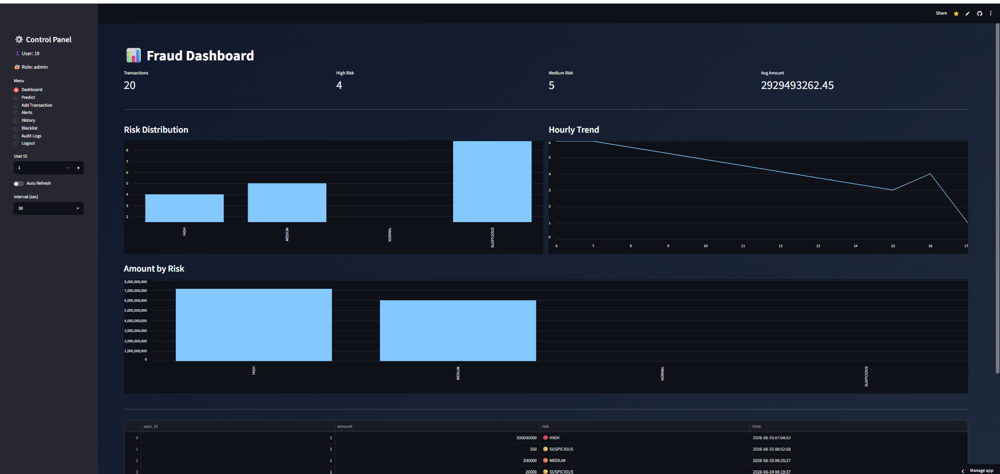
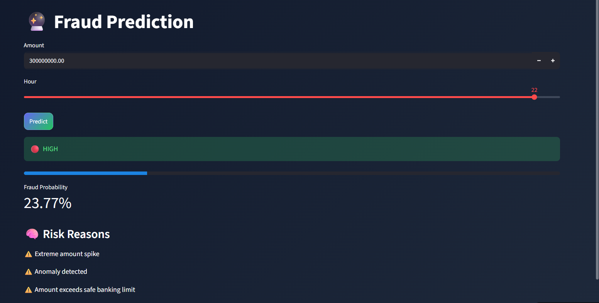
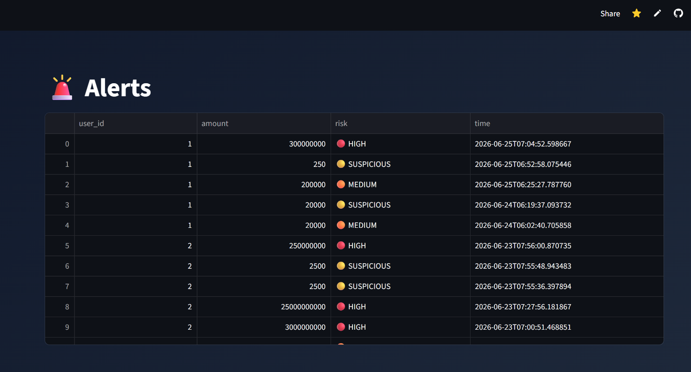
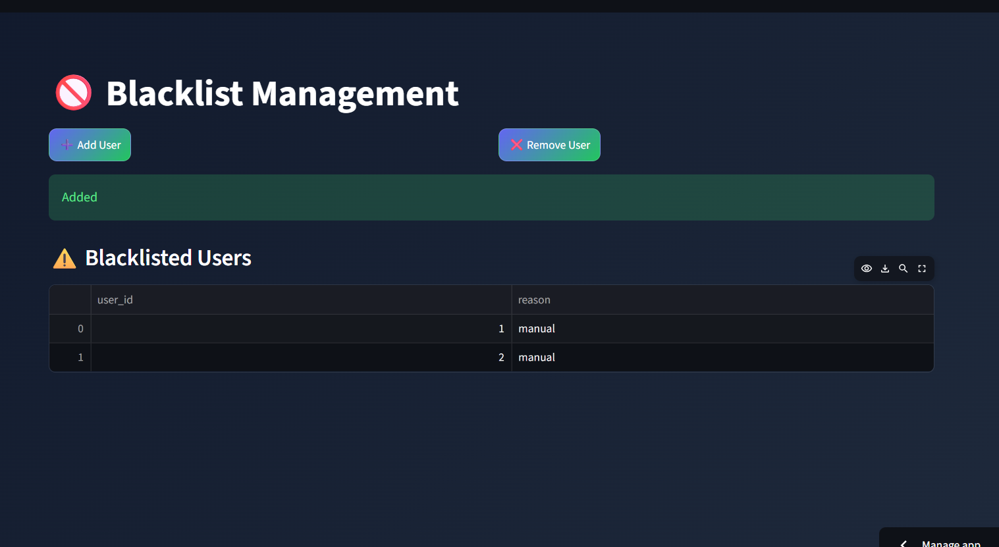
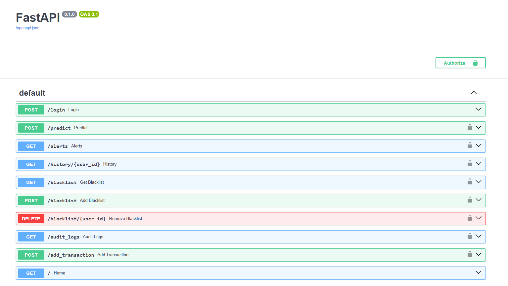
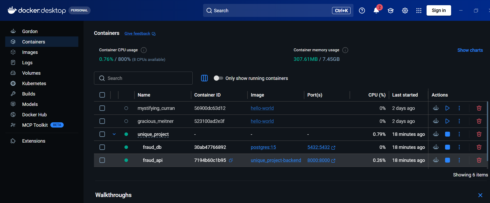

# 🚨 Fraud Intelligence System

An end-to-end AI-powered **Fraud Detection and Risk Intelligence System** built using **Machine Learning, FastAPI, Streamlit, PostgreSQL, JWT Authentication, SHAP Explainability, Docker, and Cloud Deployment**.

The system predicts fraudulent transactions in real time, provides explainable AI insights, stores transaction history, manages blacklisted users, and offers an interactive analytics dashboard for fraud monitoring.

---

# 🌟 Features

* 🔐 JWT Authentication (Admin & Analyst Roles)
* 🤖 Machine Learning-Based Fraud Detection
* 🧠 SHAP Explainable AI
* 🚨 Real-Time Risk Scoring
* 📊 Interactive Streamlit Dashboard
* 📈 Transaction Analytics
* 📜 Transaction History
* 🚫 Blacklist Management
* 📋 Audit Logs
* 🗄 PostgreSQL Database
* 🐳 Docker & Docker Compose Support
* ☁️ Cloud Deployment using Render & Streamlit Cloud

---

# 🏗️ System Architecture

```
                Streamlit Dashboard
                        │
                        ▼
                 FastAPI Backend
                        │
        ┌───────────────┴───────────────┐
        ▼                               ▼
 Machine Learning Model          PostgreSQL Database
        │                               │
        ▼                               ▼
 SHAP Explainability      Users | History | Alerts | Blacklist
```

---

# 🛠️ Tech Stack

| Category         | Technologies                      |
| ---------------- | --------------------------------- |
| Backend          | FastAPI, Uvicorn, JWT, Psycopg2   |
| Frontend         | Streamlit, Plotly, Pandas         |
| Machine Learning | Scikit-Learn, SHAP, NumPy, Joblib |
| Database         | PostgreSQL                        |
| DevOps           | Docker, Docker Compose            |
| Deployment       | Render, Streamlit Cloud, GitHub   |

---

# 📂 Project Structure

```
fraud-intelligence-system
│
├── api/
│   ├── app.py
│   ├── Dockerfile
│   └── requirements.txt
│
├── ui/
│   ├── dashboard.py
│   ├── Dockerfile
│   └── requirements.txt
│
├── models/
│   ├── fraud_model.pkl
│   └── scaler.pkl
│
├── docker-compose.yml
├── init.sql
├── requirements.txt
├── README.md
└── .gitignore
```

---

# 🚀 Installation

## Clone the Repository

```bash
git clone https://github.com/dasarichandu2309/fraud-intelligence-system.git
cd fraud-intelligence-system
```

## Install Dependencies

```bash
pip install -r requirements.txt
```

---

# ▶️ Run the Backend

```bash
cd api
uvicorn app:app --reload
```

Backend URL

```
http://localhost:8000
```

Swagger Documentation

```
http://localhost:8000/docs
```

---

# ▶️ Run the Frontend

```bash
cd ui
streamlit run dashboard.py
```

Frontend URL

```
http://localhost:8501
```

---

# 🐳 Docker

Run the complete application with Docker Compose.

```bash
docker-compose up --build
```

Stop the application

```bash
docker-compose down
```

---

# 🔑 Default Credentials

## Admin

```
Username : admin
Password : admin123
```

## Analyst

```
Username : analyst
Password : admin123
```

---

# 📡 API Endpoints

| Method | Endpoint               | Description            |
| ------ | ---------------------- | ---------------------- |
| POST   | `/login`               | User Login             |
| POST   | `/predict`             | Predict Fraud          |
| POST   | `/add_transaction`     | Add Transaction        |
| GET    | `/alerts`              | View Alerts            |
| GET    | `/history/{user_id}`   | Transaction History    |
| GET    | `/blacklist`           | View Blacklisted Users |
| POST   | `/blacklist`           | Add User to Blacklist  |
| DELETE | `/blacklist/{user_id}` | Remove User            |
| GET    | `/audit_logs`          | View Audit Logs        |

---

# 📊 Machine Learning

The fraud detection model analyzes engineered transaction features to classify transactions and estimate fraud probability.

### Risk Levels

* 🟢 LOW
* 🟡 SUSPICIOUS
* 🟠 MEDIUM
* 🔴 HIGH

Each prediction includes:

* Fraud Prediction
* Fraud Probability
* Risk Score
* SHAP Explanation
* Risk Reasons

---

# ☁️ Live Deployment

### 🚀 Backend API

https://fraud-api-mcgb.onrender.com/docs

### 🌐 Streamlit Dashboard

https://fraud-intelligence-system-7dw69keywbxafk9w4svgmd.streamlit.app/

---

# 📷 Screenshots

## 🔐 Login Page



---

## 📊 Dashboard



---

## 🤖 Fraud Prediction



---

## 🚨 Alerts



---

## 🚫 Blacklist Management



---

## 📖 Swagger API Documentation



---

## 🐳 Docker Containers




Suggested screenshots:

* 🔐 Login Page
* 📊 Dashboard
* 🤖 Fraud Prediction
* 🚨 Alerts
* 🚫 Blacklist
* 📜 Audit Logs
* 📖 Swagger Documentation
* 🐳 Docker Containers Running

---

# 🚀 Future Enhancements

* Email Notifications
* SMS Alerts
* Redis Caching
* Apache Kafka Streaming
* Kubernetes Deployment
* CI/CD Pipeline
* Multi-Factor Authentication (MFA)
* Advanced AI Anomaly Detection

---

# 👨‍💻 Author

**Chandu Dasari**

GitHub
https://github.com/dasarichandu2309

LinkedIn
https://www.linkedin.com/in/dasari-chandu-4374022b6

---

## ⭐ If you found this project helpful, please consider giving it a Star.
